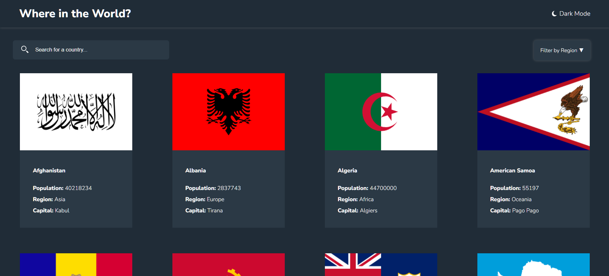

# Frontend Mentor - REST Countries API with color theme switcher

This is a solution to the [REST Countries API with color theme switcher on Frontend Mentor](https://www.frontendmentor.io/challenges/rest-countries-api-with-color-theme-switcher-5cacc469fec04111f7b848ca). Frontend Mentor challenges help you improve your coding skills by building realistic projects.

## Table of contents

- [Overview](#overview)
  - [The challenge](#the-challenge)
  - [Screenshot](#screenshot)
  - [Links](#links)
- [My process](#my-process)
  - [Built with](#built-with)
- [Author](#author)

## Overview

REST Countries API with color theme switcher is built by ReactJS and Styled Components. The website has a dark/light mode switcher.

### The challenge

Users should be able to:

- Search for a country to view
- Filter the countries according to region
- Switch the light or dark mode of the website
- View the optimal layout for the site depending on their device's screen size
  
### Screenshot

### Links

- Solution URL: (https://www.frontendmentor.io/solutions/rest-countries-api-with-color-theme-switcher-Px6akcdvnG)
- Live Site URL: (https://countries-tau-weld.vercel.app/)

### Built with

- [React](https://reactjs.org/) - JS library
- Styled Components - For styles

## Author

- Frontend Mentor - [@sedcakmak](https://www.frontendmentor.io/profile/sedcakmak)
- GitHub - [@sedcakmak](https://github.com/sedcakmak)
